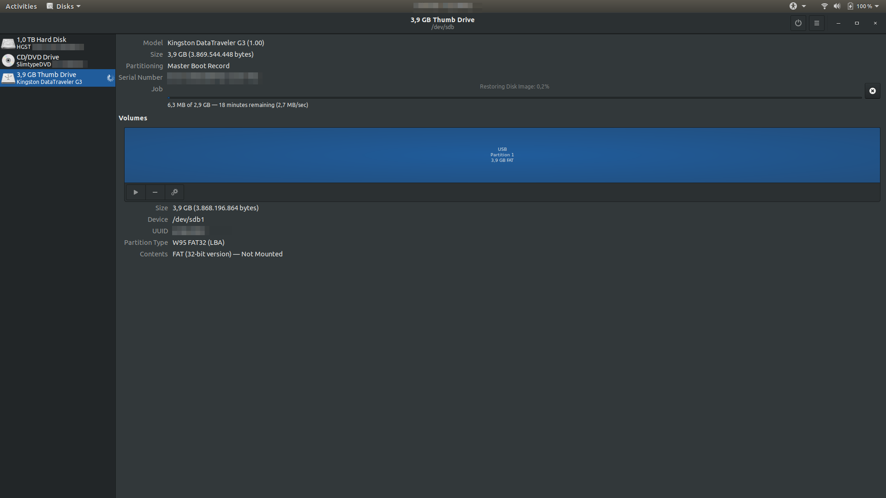

# Preparativos previos a la instalación
## Creación de USB Booteable
### Windows

### Linux

#### Interfaz gráfica (GUI)
En este caso usare la herramienta `Disks` que viene instalado por defecto en Ubuntu.
Como se observa en la imagen, basta con buscarlo directamente con el nombre `Disks` o `Discos`.


Una vez abierta la herramienta.

!!! warning "Considerar"
    Que el `Disco Duro(HDD)` también es una unidad de almacenamiento por lo tanto estará listado. Cuidado con escoger el disco duro para crear el Booteable.

1. Se procederá a escoger la unidad de Almacenamiento para crear el USB Booteable.


2. Luego en el menú ubicado en el lado derecho superior, como se observa en la imagen siguiente, y se le dará a la opción `Restore Disk Image`.


3. Aparecerá una ventana `Restore Disk Image`, que nos permitirá escoger la imagen `iso` que necesitamos al dar clic en `Image to Restore` para el Booteable. 


4. Después de seleccionar la imagen `iso` puede aparecer una alerta. Esto se debe a que el tamaño de la imagen `iso` es muy pequeña comparado con la capacidad de almacenamiento del USB, es decir te sobra espacio de almacenamiento en el USB. Por lo que se puede continuar con el proceso dandole clic en `Start Restoring...`.


5. Antes de comenzar la restauración, te aparecerá una ventana para corroborar la unidad escogida. Dar clic en `Restore` para comenzar el proceso.


6. Comenzará el proceso de generar el USB Booteable como se muestra en la siguiente imagen. El proceso puede tardar algunos minutos



#### Comando de Linea (CLI)
Como no siempre se tiene interfaz gráfica, aquí explicaré el uso del comando `DD` o Copia en Duro para la creación de un USB boot.


Debemos encontrar el FileSystem donde se encuentra montado nuestro USB para ello usaremos el comando `df`, que nos listará todas las particiones que tiene montado el sistema operativo.
``` bash
df -h
```
Resultado
``` bash hl_lines="25"
Filesystem      Size  Used Avail Use% Mounted on
udev            7,8G     0  7,8G   0% /dev
tmpfs           1,6G  2,1M  1,6G   1% /run
/dev/sda7       101G   12G   84G  13% /
tmpfs           7,8G  286M  7,6G   4% /dev/shm
tmpfs           5,0M  4,0K  5,0M   1% /run/lock
tmpfs           7,8G     0  7,8G   0% /sys/fs/cgroup
/dev/loop0       15M   15M     0 100% /snap/gnome-characters/399
/dev/loop1      161M  161M     0 100% /snap/gnome-3-28-1804/116
/dev/loop4       90M   90M     0 100% /snap/core/8268
/dev/loop3       55M   55M     0 100% /snap/core18/1668
/dev/loop5       45M   45M     0 100% /snap/gtk-common-themes/1440
/dev/loop2      1,0M  1,0M     0 100% /snap/gnome-logs/81
/dev/loop7      3,8M  3,8M     0 100% /snap/gnome-system-monitor/127
/dev/loop8      4,3M  4,3M     0 100% /snap/gnome-calculator/544
/dev/loop6       92M   92M     0 100% /snap/core/8689
/dev/sda5       1,9G  119M  1,7G   7% /boot
/dev/sda8       305G  8,2G  282G   3% /home
tmpfs           1,6G   20K  1,6G   1% /run/user/121
tmpfs           1,6G   60K  1,6G   1% /run/user/1000
/dev/loop9       15M   15M     0 100% /snap/gnome-characters/495
/dev/loop10     1,0M  1,0M     0 100% /snap/gnome-logs/93
/dev/loop11     4,4M  4,4M     0 100% /snap/gnome-calculator/704
/dev/loop12     3,8M  3,8M     0 100% /snap/gnome-system-monitor/135
/dev/sdb        7,5G  1,4G  6,1G  18% /media/userName/USB
```
Nos interesa saber la información de la columna `FileSystem` ***(linea número 25 resaltada)*** donde usualmente la ruta de directorio montaje de un USB sigue el patrón `/media/nombreUsuario/nombreUSB`. 

Del resultado mostrado, nuestro USB se encuentra en el FileSystem `/dev/sdb`. Esa información será nuestra ruta destino para el uso del comando `dd`.

A continuación se muestra la sintaxis del comando 
``` bash
dd if=/ruta/Origen of=/ruta/Destino bs=tamanhoBloque
```

Si bien ese comando nos ayudará a copiar la imagen `iso` a nuestro USB al ejecutarlo no podremos enterarnos en que momento acaba el proceso, lo cual puede generarnos algunas dificultades para saber cuando termina. Por ello se usará el comando `pv`, que nos permitirá monitorizar como va el proceso de copia. 

Para instalar `pv`, ejecutar el siguiente comando en la consola.
``` bash
sudo apt install pv
```

Como tenemos la ruta de Destino con ayuda del comando `df`, ahora necesitamos la ruta donde se encuentra descargado nuestra imagen `iso`. Y se tendrá un comando de linea similar al siguiente:
``` bash
dd if=/home/userName/Download/kali-linux-2020.1-live-amd64.iso bs=1M | pv | dd of=/media/userName/USB bs=1M 
```

## Preparar una maquina Virtual
### VirtuaBox
#### Software a descargar

### VMWare
#### Software a descargar